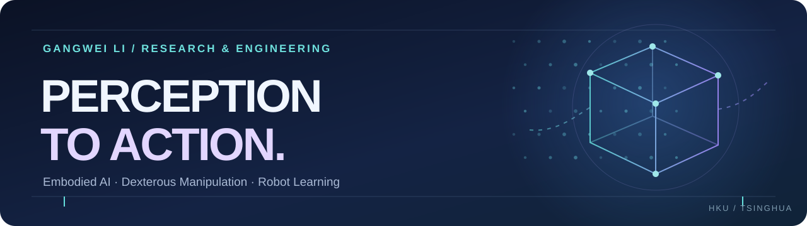

  

# Gangwei Li (Steven)

**Embodied AI · Dexterous Manipulation · Robot Learning**

Mechanical Engineering at The University of Hong Kong 
Research Assistant at Tsinghua University

[Email](mailto:Steven.LI@connect.hku.hk) &nbsp;·&nbsp; [LinkedIn](https://www.linkedin.com/in/gangwei-li) &nbsp;·&nbsp; [Explore projects](#selected-work)

## Research focus

I build reproducible systems for embodied intelligence, connecting visual perception, dexterous manipulation, human-to-robot retargeting, and simulation-based evaluation.

- **Perception → action:** make 3D observations useful through calibrated coordinates, geometry, and robot-ready targets.
- **Dexterous interaction:** study hand representation, retargeting, grasping, and the constraints of real mechanisms.
- **Reproducible evaluation:** make inputs, assumptions, experiments, and failure cases clear enough to revisit.

中文简介

我的研究聚焦具身智能、灵巧操作、人到机器人重定向、机器人学习与可复现仿真评测。我也希望把三维视觉中的表示、坐标与标定讲清楚，帮助更多人将感知结果可靠地用于机器人任务。

## Selected work

### 01 / [3D Vision · Zero to Hero](https://github.com/Dld0621/3D-Vision-Zero-to-Hero)

A complete **Chinese and English** guide to point clouds, meshes, MANO, NeRF, 3D/4D Gaussian Splatting, and the path from capture and calibration to robot applications. Includes diagrams, small CPU exercises, and explicit validation status.

[中文入口](https://github.com/Dld0621/3D-Vision-Zero-to-Hero) · [English guide](https://github.com/Dld0621/3D-Vision-Zero-to-Hero/blob/main/README.en.md)

### 02 / [Embodied AI · Zero to Hero](https://github.com/Dld0621/Embodied-AI-Zero-to-Hero)

Bilingual foundations and an engineering route through robot development, with documented setup, pipelines, runnable baselines, and evidence checks.

### 03 / [Embodied AI Paper Analysis](https://github.com/Dld0621/Embodied-AI-Paper-Analysis)

A bilingual research workbench and systematic 2022–2026 conference census for navigating embodied AI literature.

---

**From perception to action, with evidence at every step.**

